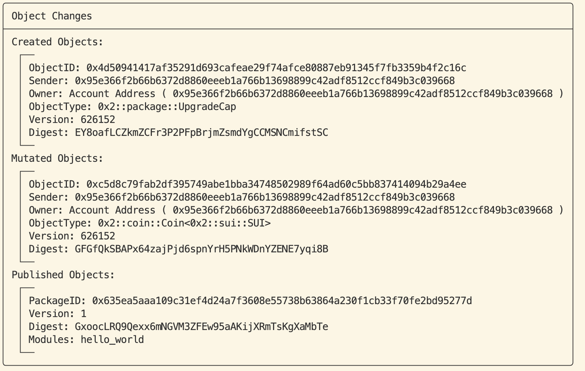

# Hello Sui

> 完成了前期的环境配置, 让我们来写一个 Sui Move 的 Hello World 合约并发布到 Sui 链上

## 创建 hello world package

- 在命令行执行: 
  ```
  sui move new hello_world_package
  ```

  - 目录结构如下, 包含一个 Move.toml 文件以及 sources 目录

    ```bash
    hello_world_package├── Move.toml└── sources
    ```

  - 默认的 `Move.toml` 文件(随着 sui 的更新, 默认文件可能也会随之更新)

  - **注意: 要手动在 `Move.toml` 的 [package] 下添加 `version = "0.0.1”` , 否则 vscode move 插件无法提供代码提示和跳转**

    ```bash
    [package]
    name = "hello_world_package"
    version = "0.0.1"
    
    [dependencies]
    Sui = { git = "<https://github.com/MystenLabs/sui.git>", subdir = "crates/sui-framework/packages/sui-framework", rev = "framework/testnet" }

    [addresses]
    hello_world_package = "0x0"

    [dev-dependencies]
    
    [dev-addresses]
    ```

## 定义 hello_world module

- 在 sources 文件夹下新建一个 `hello_world.move` 文件: 

  ```
  sui/sources/hello_world.move
  ```

  - `hello_world_package` 对应于 `Move.toml` 中 address 下的地址别名, 代指 `0x0`

  - 内容如下( 现在不需要关心太多 Move 语法, 后面的章节会实践语法)

    ```bash
    module hello_world_package::hello_world {
        use std::string;
        use sui::object::{Self, UID};
        use sui::transfer;
        use sui::tx_context::{Self, TxContext};
    
        // An object that contains an arbitrary string
        struct HelloWorldObject has key, store {
            id: UID,
            /// A string contained in the object
            text: string::String
        }
    
        public entry fun mint(ctx: &mut TxContext) {
            let object = HelloWorldObject {
                id: object::new(ctx),
                text: string::utf8(b"Hello World!")
            };
            transfer::public_transfer(object, tx_context::sender(ctx));
        }
    }
    ```

## Build hello world package

- 在命令行中执行(位置在 hello_world_package 文件夹的根目录下): 

  ```
  sui move build
  ```

   (这个过程如果失败, 需要科学上网)

  - 成功 build 之后, 会在 console 打印出下方的内容:

    ```bash
    UPDATING GIT DEPENDENCY <https://github.com/MystenLabs/sui.git>
    INCLUDING DEPENDENCY Sui
    INCLUDING DEPENDENCY MoveStdlib
    BUILDING hello_world_package
    ```

## 发布(publish) hello world package

- 需要先去 faucet(水龙头领水), 领取测试代币

- 在 hello_world_package 文件夹下执行下方的命令发布package 到 Sui 链上

  - `sui client publish --gas-budget 1000000000`

- 发布成功之后会返回一些信息, 可以复制任意一个 ID, 将他复制到 [Sui 区块链浏览器](https://suiexplorer.com/) 中, 即可查看我们部署的 Hello World package!

  - **需要记录返回结果中的 Object Changes 下的 Published Objects 中的 Package ID**, 后面需要通过这个 ID 来调用我们部署到区块链上的 Hello World 合约 (通过 ID 定位到 Package)

  - 将 Sui 区块链浏览器的网络改为 Testnet 或者 Devnet (具体是哪个网络取决于 `Move.toml` 中的 dependence 下中 Sui 最后是 testnet 还是 devnet)

    

  - 将复制的 ID 按照下面图片的形式粘贴并搜索, 就能看到 Publish 产生的一些 Object

## 调用在链上的 Hello World 合约

到了上面记录的 Package ID 派上用场的时候啦! 我们使用下面的命令调用部署到 Sui 区块链上的 hello world 合约:

- package 后面的 ID 改成你们记录的 Package ID:  `sui client call --package 0x635ea5aaa109c31ef4d24a7f3608e55738b63864a230f1cb33f70fe2bd95277d  --module hello_world --function mint --gas-budget 10000000`

- 返回的信息中的Object changes 中的第一个 Object ID, 就是我们 Mint 出来的 Hello World Object

  

- 复制上面的 Object ID 到 Sui 区块链浏览器中, 就能看到 Hello World Object 下的 `Text` 字段中的 Hello World 啦!

  