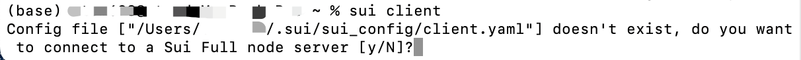
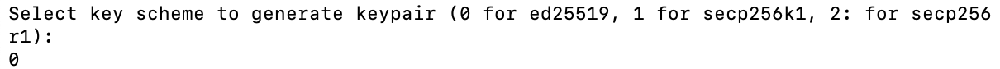
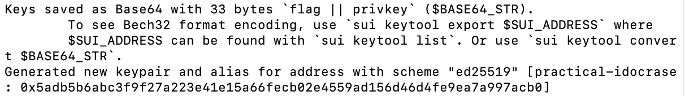
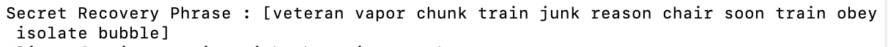

## Cli_Start

> 到这里大家应该都解决了Sui Client的安装问题，接下来讲述Sui Client命令的一些基础用法。

### 1、sui client命令

安装后第一次使用，我们可以通过命令开始最初的Sui Cli配置：

```
sui client
```

执行命令之后有几个步骤需要选择，详情如下：

（1）创建配置文件

这里选择`y`，使用sui的官方节点。



（2）选择节点

然后需要输入节点的url，或者默认`Devnet`节点，这里我们也选择默认。


（3）选择密钥对的加密方式

这里默认可以选择`0`



然后就完成了初始配置创建。

### 2、钱包地址和助记词

在第三步执行完之后会生成自己的钱包地址和助记词，这个需要大家了解以及记录。

#### 2.1 钱包地址

在`sui client`命令执行完之后，终端中会显示出我们刚刚创建的钱包地址：

```
0x5adb5b6abc3f9f27a223e41e15a66fecb02e4559ad156d46d4fe9ea7a997acb0
```



后续我们进行合约开发以及交互等都会用到自己的钱包地址。

#### 2.2 助记词

钱包的助记词是存储恢复加密货币钱包所需的全部信息的单词列表，是非常重要的，后续用来将钱包地址导入到其他钱包以及找回自己的钱包等。

在终端中的钱包地址之后会带有钱包地址的助记词：

```
veteran vapor chunk train junk reason chair soon train obey isolate bubble
```



助记词非常重要，需要保存并且不要泄露给任何人。
