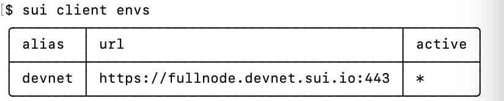
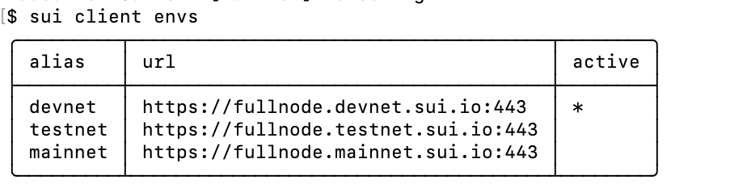
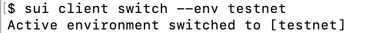

## Env

> 本章讲解的是Sui Cli中的env及其相应命令的使用。

### 1、env命令了解及使用

在Sui Cli中env相关命令与环境配置sui节点相关，可以用其来查询节点、添加节点和切换节点等。

#### 1.1 查询节点

查询env配置命令：

```
sui client envs
```



上图中展示了我们现在所有的环境节点配置信息，其中：

（1）**alias** 为节点的别名

（2）**url **为节点url地址

（3）**active** 其中的*即对应当前使用哪个节点

#### 1.2 新增节点

新增节点命令：

```
sui client new-env --alias <ALIAS> --rpc <RPC>
```

通过命令，新增testnet和mainnet节点：

```
sui client new-env --alias testnet --rpc https://fullnode.testnet.sui.io:443
sui client new-env --alias mainnet --rpc https://fullnode.mainnet.sui.io:443
```

通过上面学的命令查询，成功创建`testnet`和`mainnet`节点。



#### 1.3 切换节点

切换节点命令：

```
sui client switch --env <ALIAS>
```

我们尝试将节点切换至`testnet`：

```
sui client switch --env testnet
```

如下图所示成功切换至testnet节点：



#### 1.4 查看当前节点

除了上述使用`sui client envs`查询之外我们还有单独的命令查看当前使用的节点，可以通过此命令快速查看当前使用节点。

查看当前节点命令：

```
sui client active-env
```

