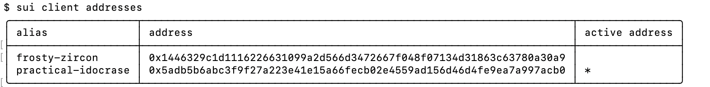
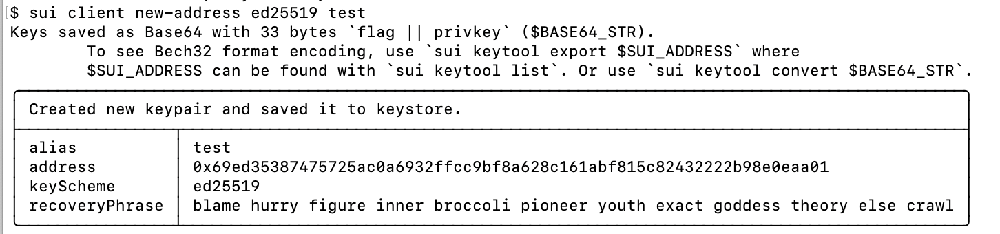
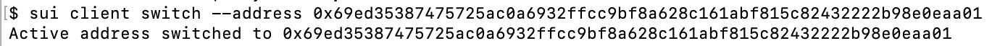
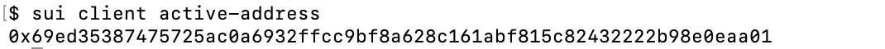

## Address

> 本章讲解的是Sui Cli中的钱包地址及其相关的操作命令。

### 1、Address命令了解及使用

在Sui Cli中address相关命令与钱包地址相关，可以用其来查询钱包地址、创建钱包地址，切换钱包地址等操作。

#### 1.1 查看钱包地址

查看所有钱包地址命令：

```
sui client addresses
```



上图中展示了我们现在所有钱包地址的信息，其中：

（1）**alias** 为钱包地址的别名

（2）**address **为钱包地址

（3）**active** 其中的*即对应当前使用哪个钱包地址

#### 1.2 新建钱包地址

新建钱包地址命令：

```
sui client new-address <KEY_SCHEME> <ALIAS>
```

其中`<KEY_SCHEME>`在之前初次使用的时候见到过，有三种可以选择：

```
0 for ed25519, 1 for secp256k1, 2: for secp256r1
```

我们还是使用`ed25519`来创建

```
sui client new-address ed25519 test
```

创建成功后入下图所示：



注：再次提醒，记得存储`recoveryPhrase`。

#### 1.3 切换钱包地址

切换钱包地址命令：

```
#通过地址切换
sui client switch --address 0x69ed35387475725ac0a6932ffcc9bf8a628c161abf815c82432222b98e0eaa01
```

执行命令后成功切换：



#### 1.4 查看当前钱包地址

与节点查询一样，除了上述使用sui client addresses查询之外我们还有单独的命令查看当前使用的钱包地址。

```
sui client active-address
```

查询的效果如下：


