## Coin

> 本章讲解的是Sui Cli中的coin代币及其相关的操作命令。

### 1、call命令了解及使用

在Sui Cli中通常使用call命令来进行各项交互，例如：领取测试币，发送代币，合并代币，发布合约等。

#### 1.1 领取测试币

在日常学习开发中我们常用testnet和devnet来进行合约开发，所以官方也会提供测试币供大家领取。

领取命令：

```
#testnet
curl --location --request POST 'https://faucet.testnet.sui.io/v1/gas' --header 'Content-Type: application/json' --data-raw '{ "FixedAmountRequest": { "recipient": "<ADDRESS>" } }'
#devnet
curl --location --request POST 'https://faucet.devnet.sui.io/gas' --header 'Content-Type: application/json' --data-raw '{ "FixedAmountRequest": { "recipient": "<ADDRESS>" } }'
```

测试领取：

```
#testnet
curl --location --request POST 'https://faucet.testnet.sui.io/v1/gas' --header 'Content-Type: application/json' --data-raw '{ "FixedAmountRequest": { "recipient": "0x69ed35387475725ac0a6932ffcc9bf8a628c161abf815c82432222b98e0eaa01" } }'
```

如下图所示已经领取成功：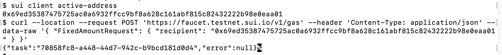

**注意：**领取不同网络的测试币时是需要切换到对应的网络。

切换至devnet领取

```
sui client switch --env devnet
#devnet
curl --location --request POST 'https://faucet.devnet.sui.io/gas' --header 'Content-Type: application/json' --data-raw '{ "FixedAmountRequest": { "recipient": "0x69ed35387475725ac0a6932ffcc9bf8a628c161abf815c82432222b98e0eaa01" } }'
```

如下图所示已经领取成功：

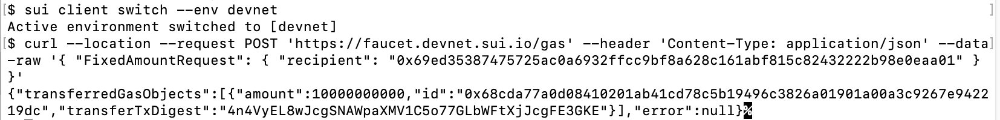

#### 1.2 查询钱包代币数量

上一小节了解了如何领取测试币，那么怎么去查询数量呢？我们可以通过查询的命令或suivision进行查询。

（1）查询的命令：

```
sui client gas
```

通过下图可以看到自己所拥有的sui代币的余额，`gasCoinId`为钱包中代币的Id，在进行代币交互的时候可能会用到。

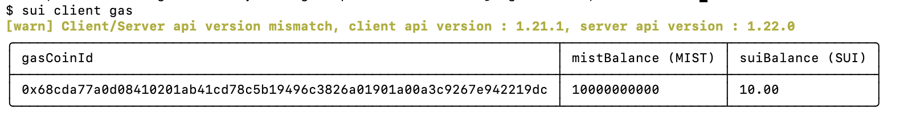

（2）通过suivision

地址：https://suivision.xyz/

在右上角切换到devnet：

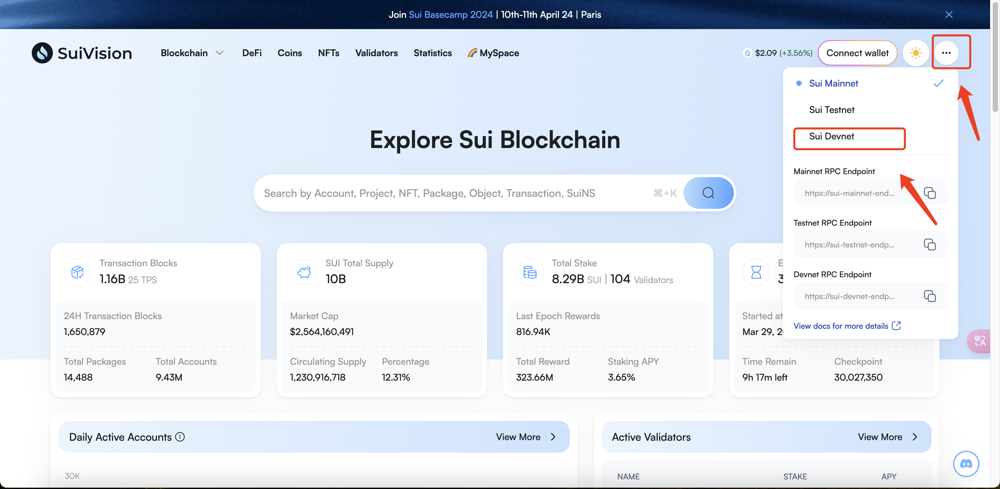

然后填入自己的钱包地址：

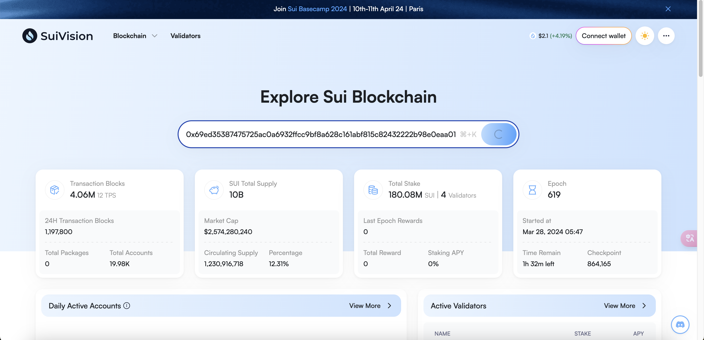

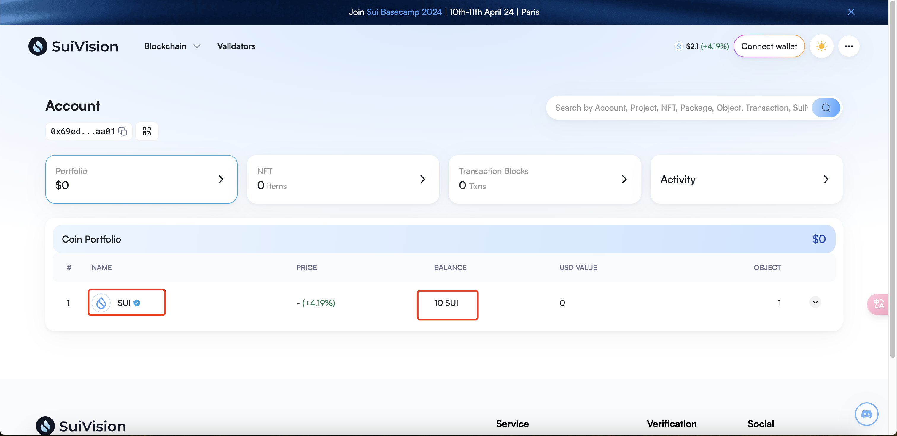

#### 1.3 发送代币

我们可以通过命令将自己钱包中的sui代币发送给其他钱包地址。

```
sui client transfer --to <接收方地址> --object-id <gasCoinId> --gas-budget 10000000
```

**注意：**--gas-budget为本次交易所需的手续费，尽量写大一些，交互中会自动计算，并不是填写的数值。

尝试发送给自己的另一个钱包地址：

```
sui client transfer --to 0x5adb5b6abc3f9f27a223e41e15a66fecb02e4559ad156d46d4fe9ea7a997acb0 --object-id 0x68cda77a0d08410201ab41cd78c5b19496c3826a01901a00a3c9267e942219dc --gas-budget 10000000
```

**注意：**在使用该命令发送会将代币余额都转移过去到接收方地址。

通过再次领取测试币后，将其中一份代币发送到接收方地址：

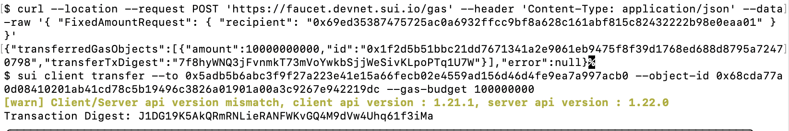

成功后会有Transaction Digest，可以用来查询本次交易的详情。

```
Transaction Digest: J1DG19K5AkQRmRNLieRANFWKvGQ4M9dVw4Uhq61f3iMa
```

然后查看接收方地址是否收到代币：


#### 1.4 合并代币

当我们有多个不同余额的代币想进行合并时可以使用下列命令：

```
sui client merge-coin --primary-coin <保留代币地址> --coin-to-merge <被合并代币地址> --gas-budget 10000000
```

再领取两次测试币然后进行代币合并：

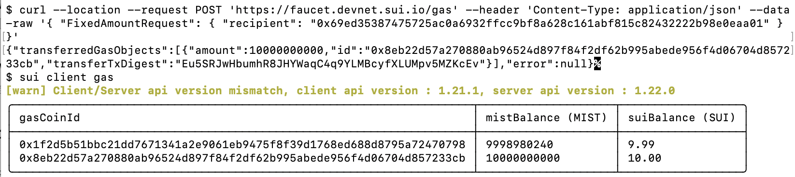

当交易时参与交易的代币余额都无法调用，需要有额外的代币余额支付交易的gas，因此需要再领取一次测试币：

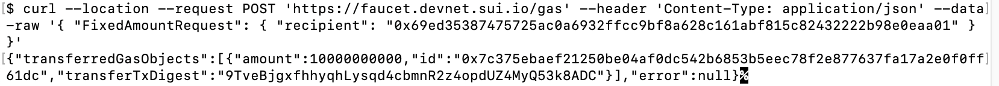

然后将代币合并：

```
sui client merge-coin --primary-coin 0x1f2d5b51bbc21dd7671341a2e9061eb9475f8f39d1768ed688d8795a72470798 --coin-to-merge 0x8eb22d57a270880ab96524d897f84f2df62b995abede956f4d06704d857233cb --gas-budget 10000000
```

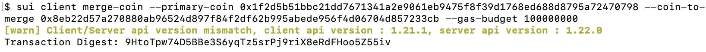

最后再次查询余额：0x8eb22d57a270880ab96524d897f84f2df62b995abede956f4d06704d857233cb中的余额已经合并到0x1f2d5b51bbc21dd7671341a2e9061eb9475f8f39d1768ed688d8795a72470798中了。

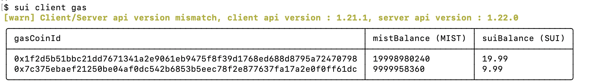