## ConnectToWallet

> 本章讲解如何将本地创建的钱包地址导入到钱包应用中，在浏览器中使用钱包访问sui链上的应用是十分方便的事情。

### 1、sui wallet安装

sui wallet安装需要在chrome浏览器应用商店中进行安装：

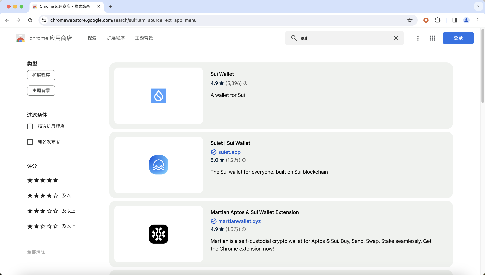

安装后如下图所示：

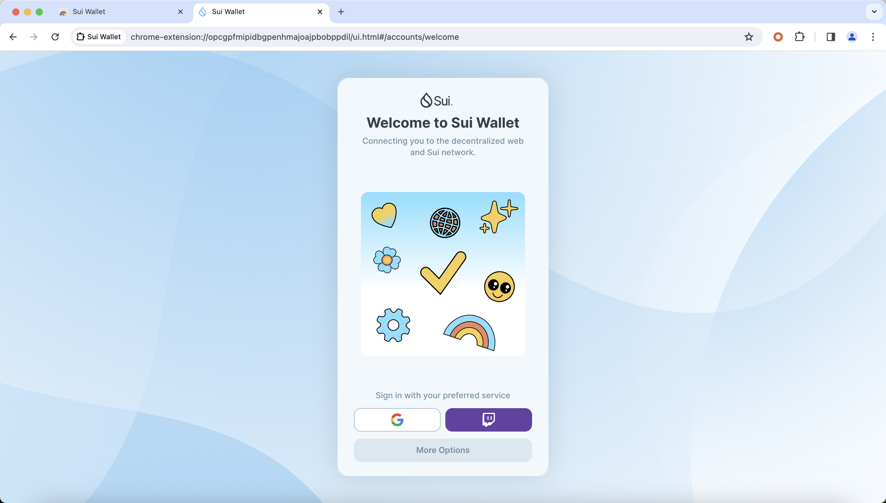

然后点击More Options，通过之前提到过的Passphrase进行钱包地址导入：

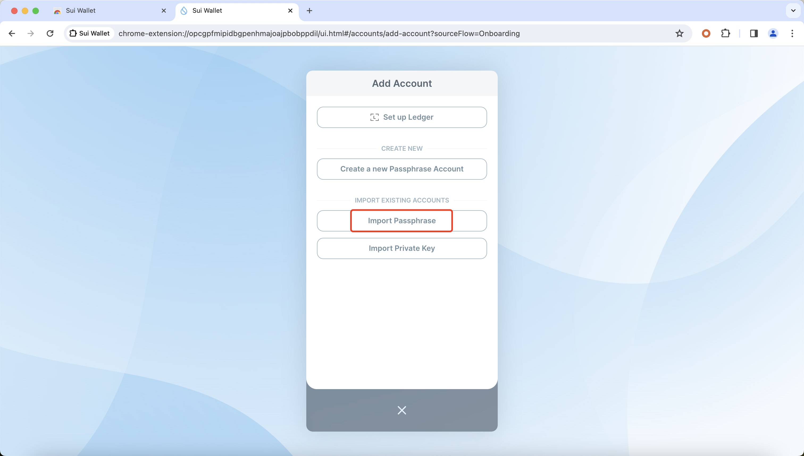

将Passphrase导入后点击Add Account:

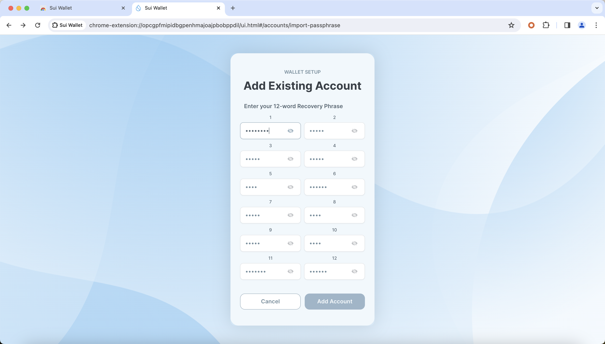

然后设置好访问钱包应用的密码，点击Create Wallet：

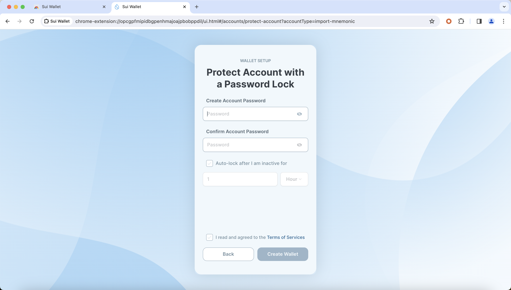

最后就可以看到自己的钱包地址了：

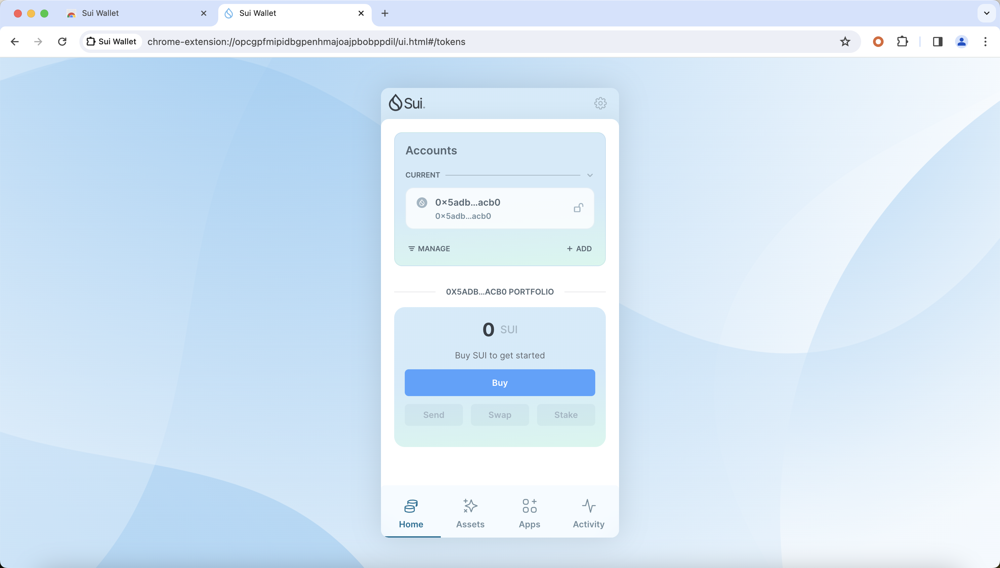

点击设置可以进行节点切换：

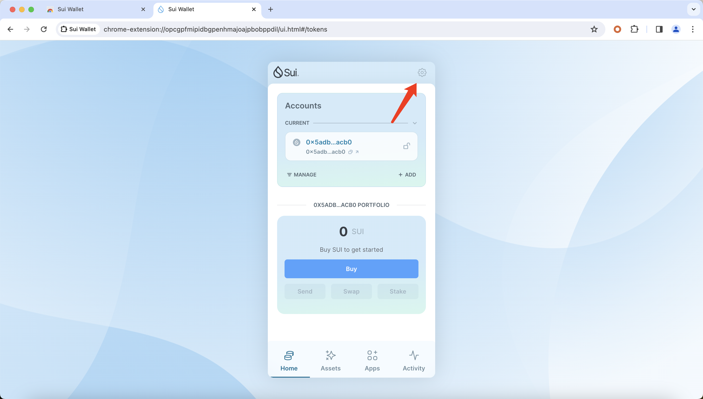

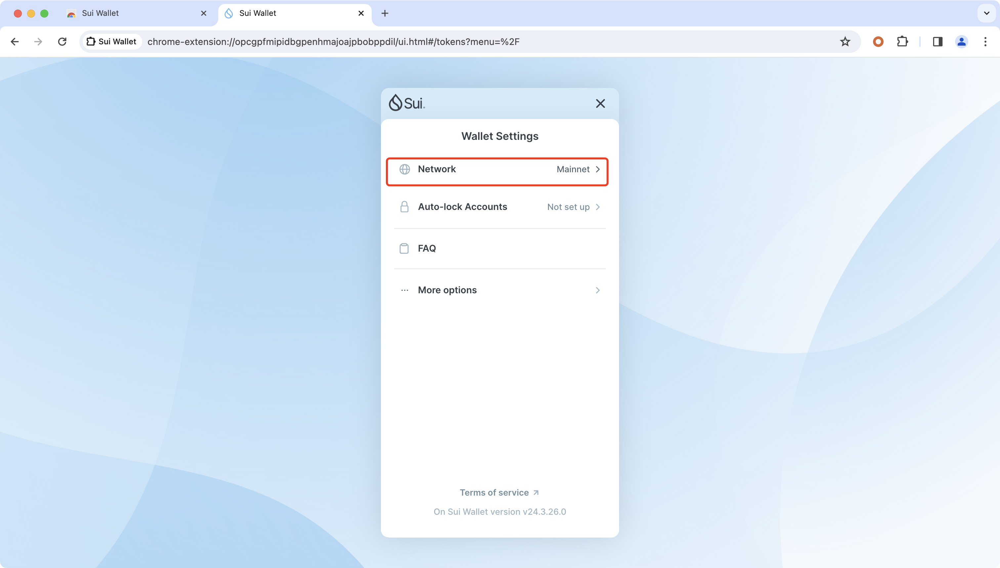

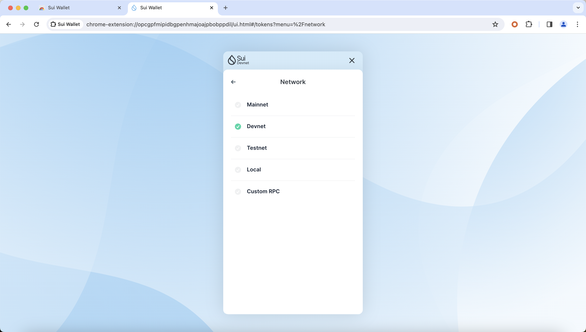

在切换到Devnet或者testnet的时候可以直接在钱包中领取测试币：

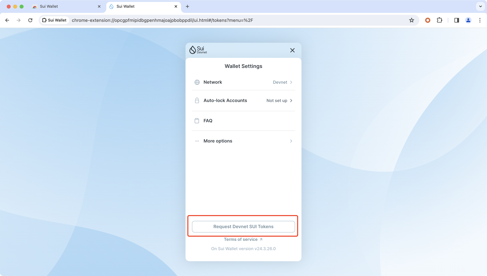

#### 1.2 sui wallet连接

我们的钱包应用可以用来连接sui链上的应用，比如suivision，点击Connect wallet：

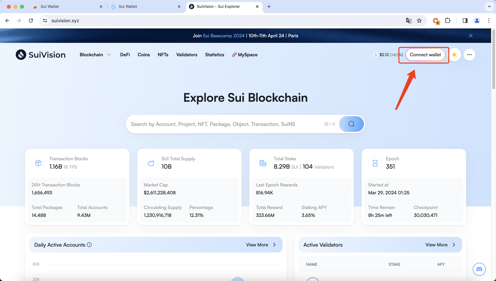

选择Sui Wallet：

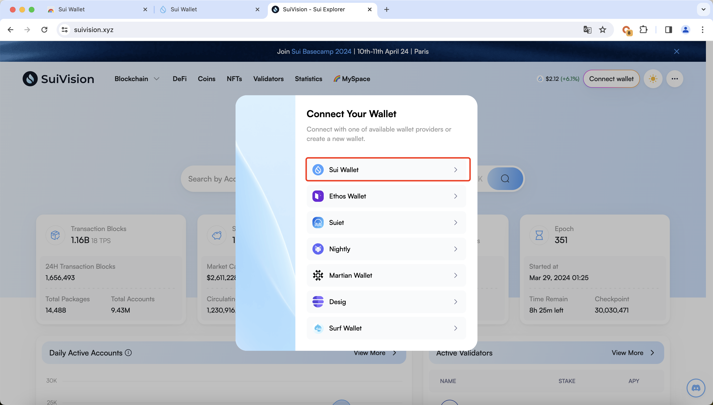

点击Connect即可：

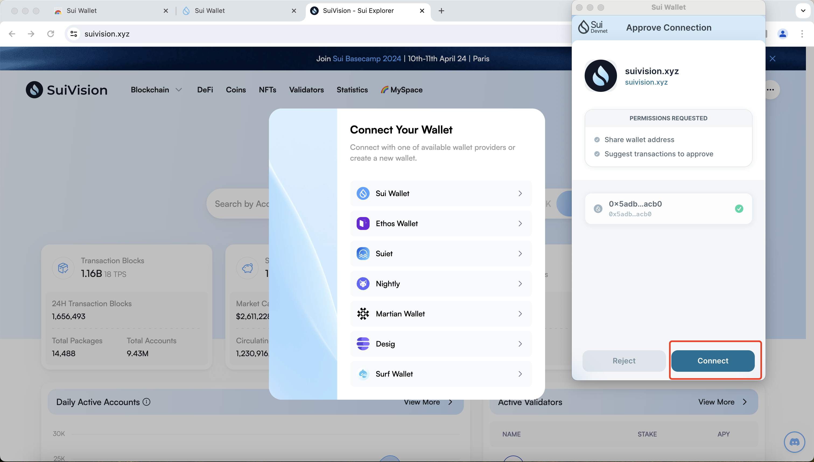

然后在进行登录：

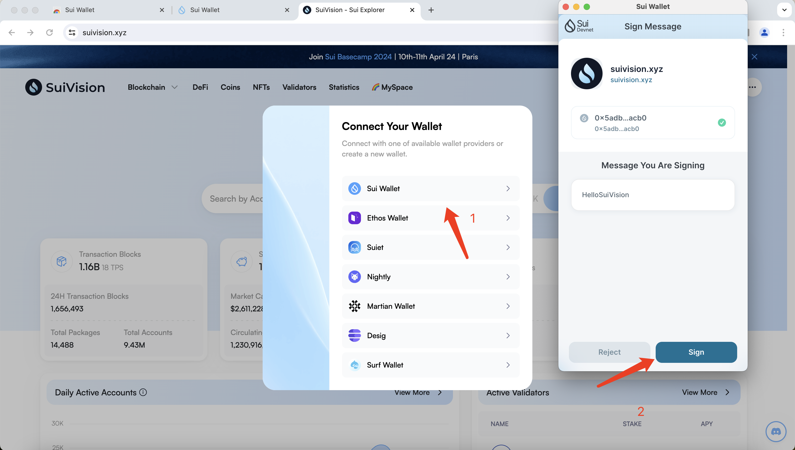

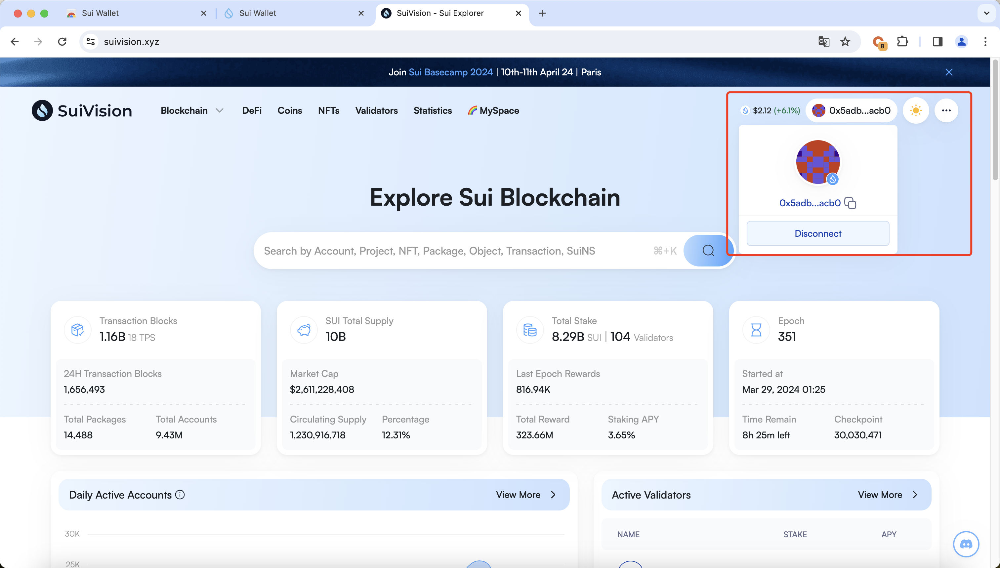

最后完成钱包的连接和应用的登录。

