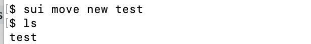
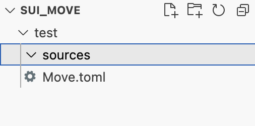

## Contract

> 本章讲解如何创建合约项目以及发布合约项目的命令。

### 1、合约项目

#### 1.1创建合约项目

我们可以通过命令快速的在本地创建一个合约项目：

```
sui move new <PackageName>
```

例如创建一个test项目，会在当前目录下创建一个test项目：

```
sui move new test
```



然后我们可以通过vscode打开，目录结构如下：



然后需要编辑`Move.toml`来进行项目配置，删除一些注释并且新增`version`：

```
[package]
name = "test"
version = "0.0.1"

[dependencies]
Sui = { git = "https://github.com/MystenLabs/sui.git", subdir = "crates/sui-framework/packages/sui-framework", rev = "framework/testnet" }


[addresses]
test = "0x0"
```

然后在source文件夹下面新建`test.move`的代码文件,并且以下面内容快速填充文件：

```
module test::my_module {

    // 第一部分: 导入sui中的模块
    use sui::object::{Self, UID};
    use sui::transfer;
    use sui::tx_context::{Self, TxContext};

    // 第二部分: 结构声明，key 能力，表示可以在地址之间转移的 Sui 对象，store 能力提供了在其他结构字段中出现并自由传输的能力。
    struct Sword has key, store {
        id: UID,
        magic: u64,
        strength: u64,
    }

    struct Forge has key, store {
        id: UID,
        swords_created: u64,
    }

    // 第三部分：模块初始化器，在合约发布时调用一次。
    fun init(ctx: &mut TxContext) {
        let admin = Forge {
            id: object::new(ctx),
            swords_created: 0,
        };
        // Transfer the forge object to the module/package publisher
        transfer::transfer(admin, tx_context::sender(ctx));
    }

    //第四部分：访问函数，允许从其他模块读取模块结构的字段。
    public fun magic(self: &Sword): u64 {
        self.magic
    }

    public fun strength(self: &Sword): u64 {
        self.strength
    }

    public fun swords_created(self: &Forge): u64 {
        self.swords_created
    }

}
```

**注意事项：**

（1）PackageName

在`test.move`中的

```
module test::my_module
```

其`test`为PackageName，必须与`Move.toml`文件中的name一致

```
[package]
name = "test"
```

（2）字符

上述为示例，但是正常代码中即使是注释中也不要写入中文，否则会出现保存或警告。

（3）Network

在`Move.toml`中含有代码：

```
[dependencies]
Sui = { git = "https://github.com/MystenLabs/sui.git", subdir = "crates/sui-framework/packages/sui-framework", rev = "framework/testnet" }
```

其中`framework/testnet`表示要发布至的节点为testnet，要确认本地网络是否与合约中的节点一致。

#### 1.2 发布合约

完成合约编写后，进去test项目文件夹，执行发布合约命令：

```
sui client publish --gas-budget 100000000 --skip-dependency-verification
```

