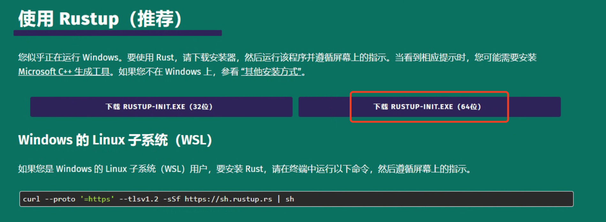
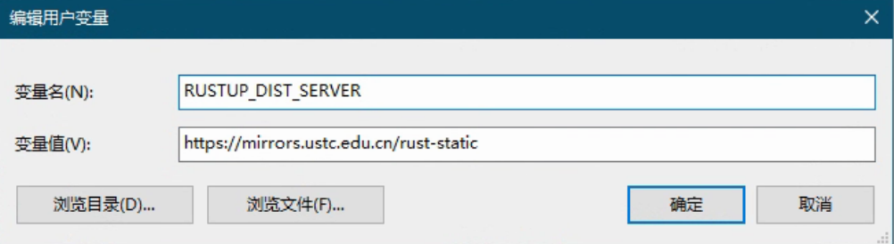
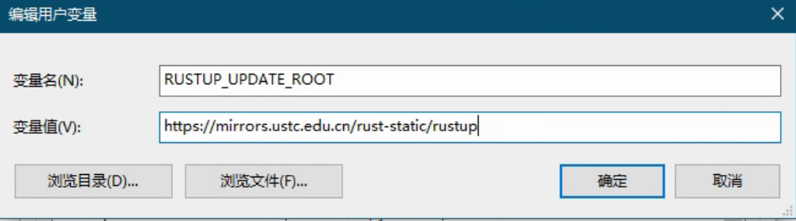
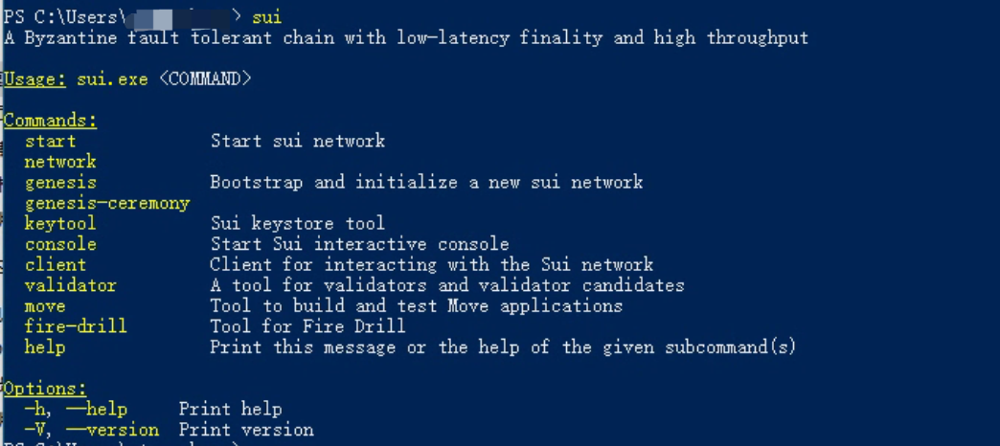
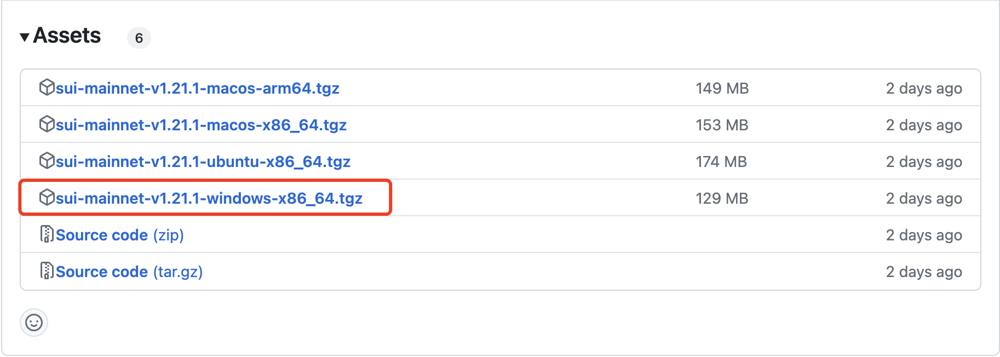
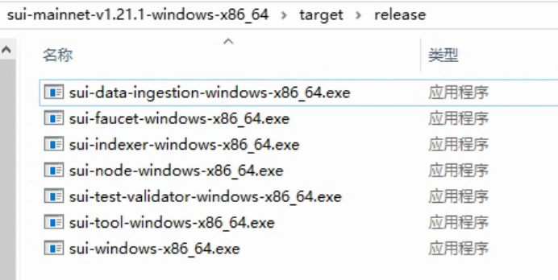
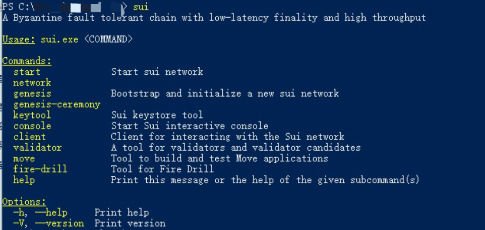
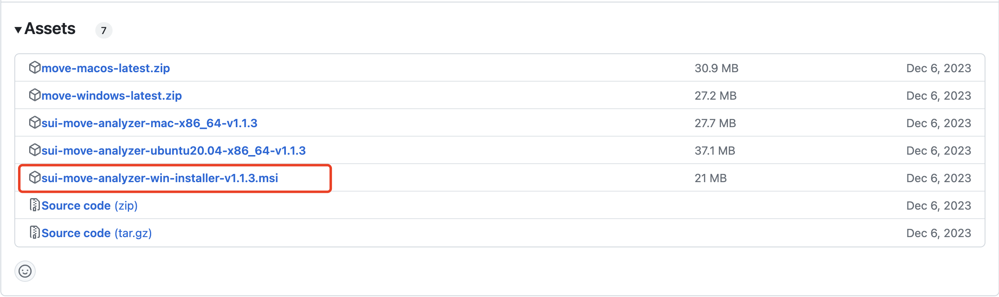

## Windows 安装sui环境

> 本文的样例安装环境Windows 11，安装 Sui 的最快方法是使用脚本安装及每个版本附带的二进制文件，编译安装的方式较为麻烦不做推荐。

### 1、环境准备工作

安装Rust and Cargo：

访问官网https://www.rust-lang.org/zh-CN/tools/install

下载exe文件



然后配置国内加速：

```
# 中国科学技术大学
RUSTUP_DIST_SERVER=https://mirrors.ustc.edu.cn/rust-static
RUSTUP_UPDATE_ROOT=https://mirrors.ustc.edu.cn/rust-static/rustup
```

windows需要手动配置：





然后运行下载的`rustup-init.exe`进行安装，这里安装步骤略过，可自行选择。

### 2、安装Sui Client

#### 2.1 脚本安装

打开powershell执行：

```shell
iex (iwr "https://gist.githubusercontent.com/WGB5445/73b3b54f8293125d4ba74260ea5a39ce/raw" ).Content
```

安装完成后如下图所示：


重启powershell：



sui默认安装在`C:\Users\用户\.sui`目录下。

#### 2.2 exe文件安装

（1）github仓库下载二进制文件

访问官方仓库https://github.com/MystenLabs/sui/releases

选择分sui网络分支进行下载，建议下载比较稳定的mainnet分支作为开发环境，目前已更新至v1.12.1。



（2）解压安装

然后将对应版本的压缩包下载至本地，解压后的目录结构如下。



接下来需要修改release文件夹下的二进制文件的文件名。

```
sui-faucet- <OS> - <ARCHITECTURE> ：本地网络上用于铸币的工具。
sui-indexer- <OS> - <ARCHITECTURE> ：本地 Sui 网络的索引器。
sui- <OS> - <ARCHITECTURE> ：Sui 的主要执行文件。
sui-node- <OS> - <ARCHITECTURE> ：用于运行本地节点。
sui-test-validator- <OS> - <ARCHITECTURE> ：用于开发的本地网络测试验证器。
sui-tool- <OS> - <ARCHITECTURE> ：提供 Sui 相关的工具。
```

我们需要将二进制文件名中的`- <OS> - <ARCHITECTURE>`进行删除，然后配置环境变量。

打开系统环境变量，编辑变量名为`Path`的变量，然后将sui所在的文件夹路径添加进去，然后确定保存即可。



完成上述操作后便能在命令行中使用 sui 命令。

#### 2.3 源代码编译安装

Windows 11 操作系统所需的先决条件包括：

- cURL
- Rust 和 Cargo
- Git CLI
- CMake
- C++ 构建工具
- LLVM 编译器

**cURL**

Windows 11 默认安装了微软版本的 [cURL](https://curl.se/windows/microsoft.html)。如果你想使用 curl 项目版本，可以从 https://curl.se/windows/ 下载并安装。

**Git CLI**

下载并安装 [Git 命令行界面](https://git-scm.com/download/)。

**CMake**

从 CMake 网站下载并安装 [CMake](https://cmake.org/download/)。

**Protocol Buffers**

下载 [Protocol Buffers](https://github.com/protocolbuffers/protobuf/releases) (protoc-xx.x-win32.zip 或 protoc-xx.x-win64.zip) 并将 \bin 目录添加到你的 Windows PATH 环境变量中。

**Windows 上的其他工具**

在运行 Windows 的计算机上，Sui 需要以下其他工具。

- 仅适用于 Windows on ARM64 - [Visual Studio 2022 预览版](https://visualstudio.microsoft.com/vs/preview/)。
- 需要 [C++ 构建工具](https://visualstudio.microsoft.com/downloads/) 来 [安装 Rust](https://docs-zh.sui-book.com/guides/developer/getting-started/sui-install#rust-and-cargo)。
- [LLVM 编译器基础设施](https://releases.llvm.org/)。查找类似于 LLVM-15.0.7-win64.exe（64 位 Windows）或 LLVM-15.0.7-win32.exe（32 位 Windows）的文件。

**已知问题** - 在 PowerShell 中，`sui console` 命令无法正常工作。

**执行安装**

运行以下命令从 `mainnet` 分支安装 Sui 二进制文件：

```
cargo install --locked --git https://github.com/MystenLabs/sui.git --branch mainnet sui
```

该命令将 Sui 组件安装在 `~/.cargo/bin` 文件夹中。

升级 Sui 二进制文件：

```
cargo install --locked --git https://github.com/MystenLabs/sui.git --branch mainnet sui
```

### 3、sui-move-analyzer

sui-move-analyzer是move语言编程的辅助插件，帮助更好的学习move语言。

#### 3.1 在vscode中安装

vscode中搜索sui-move-analyzer：


然后install进行安装即可。

#### 3.2 本地安装sui-move-analyzer

（1）msi文件安装

访问插件仓库https://github.com/movebit/move/releases/tag/sui_move_analyzer_release_v1.1.3

下载对应的版本：



将下载的文件执行安装，安装路径如下：

```
C:\Users\用户\AppData\Local\Apps\MoveBit\sui-move-analyzer\
```

本地完成后，再重启vscode即可生效，如无生效检查一下环境变量`Path`中是否配置。

（2）源码编译安装

通过cargo编译安装：

```
cargo install --git https://github.com/movebit/move --branch sui_move_analyzer sui-move-analyzer
```

因环境问题可能安装失败，建议用上一种方法。

